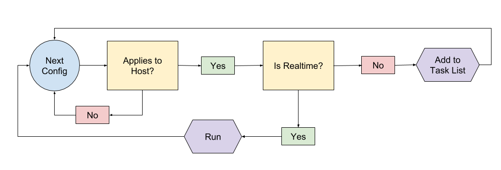

# Glazier Configuration Handlers

The Glazier configuration handling libraries are responsible for taking the
configuration language as input, determining which commands apply to the current
system, and executing them as needed.

## Pre-Processing Configuration Handler

The Pre-Processing Configuration Handler is the core configuration handler for
Glazier.

The goal of the pre-processing handler is to retrieve and parse all
configuration data in advance of executing it. This allows a start-to-finish
task list to be compiled very early-on in the imaging process. Any config
elements which apply to the host are retained in order of discovery, while
inapplicable items are discarded.

The completed task list is retained on disk for the duration of the imaging
process, and should survive expected interruptions like planned shutdowns or
reboots.

### Task List

The task list comprises a series of operations deemed applicable to the local
system. The basic structure is an ordered list, where each element in the list
maps to one element from the original config. Each top level element contains a
dictionary of keyed data.

The `data` key contains the entire original configuration element, in its
original structure. \(Generally, an action name associated with variably typed
content.\)

The task list elements may also contain additional metadata beyond the `data`
key to aid the configuration handler in managing the tasks appropriately.

The `path` key contains the configuration filesystem path from which the command
was originally sourced. This aids the command processor in resolving relative
file paths.

### Relative File References

The configuration language supports relative references to files. For example,
`#setup.bat` in a config element may refer to the file *setup.bat* in the same
configuration directory which the config yaml was retrieved from.

With the pre-processing handler, all tasks are stored in the task list to be
executed *eventually*. While the process initially parsing the config file is
aware of the active remote path at the time the config was first seen, the
libraries which subsequently execute the commands from the task list do not
inherently know where said commands originated in the config tree.

To account for this, the config handler stores the active remote path with each
command element in the task list. The runner can then feed this path back into
BuildInfo to reproduce where in the config filesystem the intake was when it
initially located the command.

### Realtime Tasks

The vast majority of configuration elements should be passed through the
configuration handler and added to the task list. Having the pre-processor
execute commands as it finds them nullifies the benefits of establishing a
persistent state task list. Still, there may be instances where it is desirable
to run a command as soon as it is discovered, rather than saving it for later.
This is particularly true in cases where the outcome of the command may actually
influence further config parsing.

One example of this behavior is the Chooser UI. End user inputs can be used to
shape which commands are run on the system (by pinning different commands based
on the various possible responses). If the UI were to be run from the task list,
it would be too late to make configuration decisions based on the results.
Instead, we mark the UI display action as realtime. This will signal the
configuration parser to run the action immediately rather than storing it. Since
the action occurs in realtime, the remainder of the configuration process is
able to act on any results that were obtained.

An action can be identified as realtime by setting the internal \_realtime
property to true in the action's setup routine.

    def _Setup(self):
      self._realtime = True
